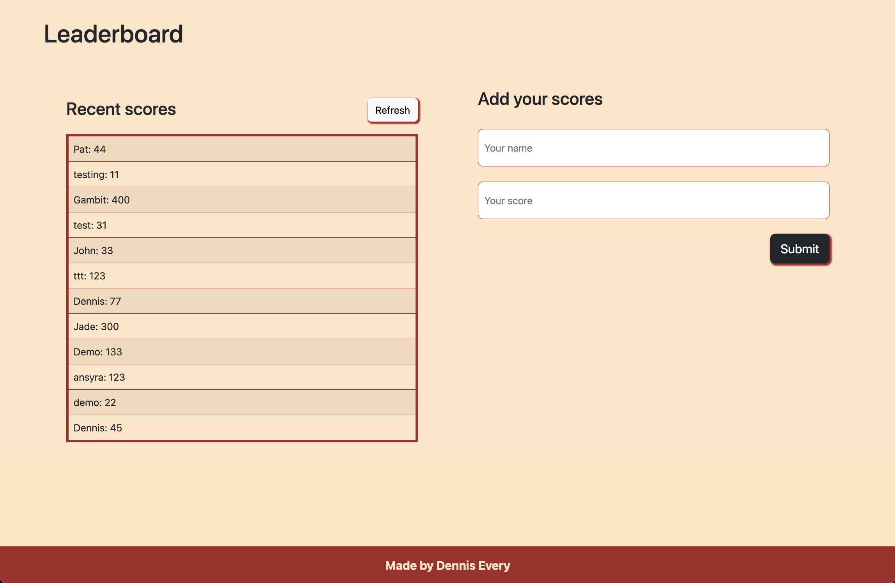

  <h1><b>LEADERBOARD</b></h1>
   
  
   

 

<!-- TABLE OF CONTENTS -->

# 📗 Table of Contents

- [📗 Table of Contents](#-table-of-contents)
- [📖 About ](#-about-)
  - [🛠 Built With ](#-built-with-)
    - [Tech Stack ](#tech-stack-)
    - [Key Features ](#key-features-)
  - [🚀 Live Demo ](#-live-demo-)
  - [💻 Getting Started ](#-getting-started-)
    - [Prerequisites](#prerequisites)
    - [Setup](#setup)
    - [Install](#install)
    - [Usage](#usage)
  - [👥 Author ](#-author-)
  - [🔭 Future Features ](#-future-features-)
  - [🤝 Contributing ](#-contributing-)
  - [⭐️ Show your support ](#️-show-your-support-)
  - [🙏 Acknowledgments ](#-acknowledgments-)
  - [❓ FAQ (OPTIONAL) ](#-faq-optional-)
  - [📝 License ](#-license-)

<!-- PROJECT DESCRIPTION -->

# 📖 About 

**Leaderboard** is a website which displays scores submitted by different players. It also allows you to submit your score. All data is preserved thanks to the external Leaderboard API service.

## 🛠 Built With 

### Tech Stack 

  
Client

  <ul>
    <li><a href="https://developer.mozilla.org/en-US/docs/Web/JavaScript">JavaScript</a></li>
  </ul>
  <ul>
    <li><a href="https://developer.mozilla.org/en-US/docs/Web/HTML">HTML</a></li>
  </ul>
  <ul>
    <li><a href="https://developer.mozilla.org/en-US/docs/Web/CSS">CSS</a></li>
  </ul>

  
Server

  <ul>
    <li><a href="#">N/A</a></li>
  </ul>

Database

  <ul>
    <li><a href="#">N/A</a></li>
  </ul>

<!-- Features -->

### Key Features 

- **Leaderboard displays the scores submitted by different players**
- **Leaderboard allows you to submit your score**
- **Leaderboard data is preserved thanks to the external Leaderboard API service**

(<a href="#readme-top">back to top</a>)

<!-- LIVE DEMO -->

## 🚀 Live Demo 

- [Leaderboard](https://dennis-every.github.io/Leaderboard)

(<a href="#readme-top">back to top</a>)

<!-- GETTING STARTED -->

## 💻 Getting Started 

To get a local copy up and running, follow these steps.

### Prerequisites

In order to run this project you need:

- A working computer.
- Connection to internet.

### Setup

Clone this repository to your desired folder:

- git clone https://github.com/dennis-every/Leaderboard.git
- Open the files in your text editor.

### Install

You don't need to install anything.

### Usage

To run the project, execute the following command:

- npm install
- npm start

(<a href="#readme-top">back to top</a>)

<!-- AUTHOR -->

## 👥 Author 

👤 **Dennis Every**

- GitHub: [@dennis-every](https://github.com/dennis-every)

(<a href="#readme-top">back to top</a>)

<!-- FUTURE FEATURES -->

## 🔭 Future Features 

- [ ] **Add functionalities to add scores through the form**
- [ ] **Add functionalities to upload and retrieve scores from the API**

(<a href="#readme-top">back to top</a>)

<!-- CONTRIBUTING -->

## 🤝 Contributing 

Contributions, issues, and feature requests are welcome!

Feel free to check the [issues page](../../issues/).

(<a href="#readme-top">back to top</a>)

<!-- SUPPORT -->

## ⭐️ Show your support 

If you like this project feel free to fork it and use it as you need.

(<a href="#readme-top">back to top</a>)

<!-- ACKNOWLEDGEMENTS -->

## 🙏 Acknowledgments 

I would like to thank Microverse for the information provided to build this project.

(<a href="#readme-top">back to top</a>)

<!-- FAQ (optional) -->

## ❓ FAQ (OPTIONAL) 

- **Can I use the project for any purpose?**

  - Yes, you can use this files for anything you need

- **Is the information saved in any database?**

  - No, all data is saved in the Leaderboard API

(<a href="#readme-top">back to top</a>)

<!-- LICENSE -->

## 📝 License 

This project is [MIT](./MIT.md) licensed

(<a href="#readme-top">back to top</a>)

